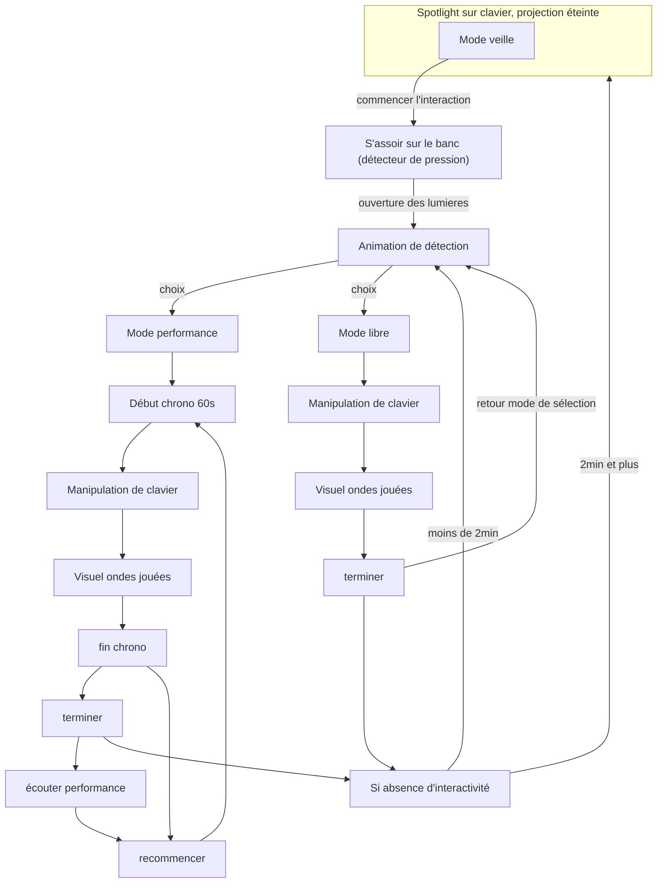

# Wave3D - Concept
*Faites prendre formes les sons que votre imagination compose*

## Concept

***Wave3D*** propose une interaction directe avec un clavier piano qui, à chaque note jouée, fait vibrer des cordes physiques. Ces vibrations révèlent visuellement les ondes sonores et les fréquences produites. Le public est invité à expérimenter et à observer la manière dont les sons prennent forme, offrant une exploration à la fois auditive et visuelle des compositions musicales.

### Public cible & objectif
- L'installation est conçue pour les gens de tout âge

L'installation invite le public à explorer la nature du son et des compositions mélodiques en découvrant les ondes que ceux-ci génèrent.

## Mise en scène

L'interacteur est accueilli dans une pièce sombre, où un projecteur éclaire un piano au centre, accompagné d'un banc sur lequel il est invité à s'asseoir. Une douce ambiance sonore joue en fond, renforçant l'immersion. Dès qu'il s'installe, un détecteur de pression sous le banc capte sa présence et déclenche une animation de bienvenue, illuminant les cordes face au clavier. L'interacteur est alors invité à jouer, produisant des ondes sonores qui font vibrer les cordes en synchronisation avec les notes. Il peut choisir entre deux modes : le mode "performance", pour enregistrer ses compositions, ou le mode "libre", pour explorer et s'amuser en toute simplicité avec le clavier.

## Moodboard Visuel

### Référence visuelles

- [Exemple cordes](https://www.youtube.com/watch?v=ttgLyWFINJI)

## Moodboard Sonore

- [Ambiance sonore 1](https://www.youtube.com/watch?v=3zPv7oMaR_g)
- [Ambiance sonore 2](https://www.youtube.com/watch?v=EAIEqDT63tg)

## Scénario interactif

## Composantes techniques

### Composantes principales

- **Piano** : Un clavier numérique qui génère les sons et ondes selon les notes jouées.
  
- **Cordes vibrantes** : Des cordes physiques (comme des cordes de guitare ou des fils tendus) reliées à un système de vibration ou de résonance pour réagir aux fréquences et ondes sonores produites par le clavier.
  
- **Amplificateurs et transducteurs** : Ces dispositifs permettent de convertir les signaux sonores en vibrations physiques sur les cordes, les faisant réagir aux sons produits par le clavier.
  
- **Système de détection de présence (capteur de pression)** : Un capteur de pression ou un interrupteur caché sous le banc pour détecter la présence de l'utilisateur et déclencher l’animation de bienvenue.
  
- **Système de projection et éclairage** : Un projecteur pour éclairer le clavier et des lumières LED ou un système d'éclairage programmable pour illuminer les cordes pendant l'animation.
  
- **Interface de contrôle (ordinateur ou microcontrôleur)** : Un ordinateur ou un microcontrôleur (comme Arduino ou Raspberry Pi) pour gérer les interactions entre les capteurs, le clavier, les transducteurs et les lumières. Il centralise les signaux et déclenche les différentes actions (lumières, sons, vibrations).
  
- **Système d'enregistrement audio** : Un système d'enregistrement pour sauvegarder les compositions créées par l'interacteur.
   
- **Enceintes et système audio** : Pour la diffusion de l’ambiance sonore et des sons générés par le clavier, un système de haut-parleurs est nécessaire.
  
- **Logiciel interactif** : Un programme qui synchronise les actions, comme l'activation des cordes en fonction des notes jouées, la gestion des modes "performance" et "libre", ainsi que l’enregistrement des sons. (Touchdesigner ou MAX)
  
- **Support structurel** : Un cadre solide ou un système de montage pour maintenir les cordes tendues et bien alignées par rapport au clavier.

 

### Autres matériaux

- **Lumières LED** : Installées sur la structure supportant les cordes, elles apportent une fonction esthétique en illuminant les vibrations et réagissant aux sons, renforçant ainsi l’aspect visuel de l’expérience.

- Câblage requis : XLR, ethernet, extentions électriques, etc.

 

### Logiciel

#### TouchDesigner
Fonction : Plateforme de création visuelle en temps réel.
- Utilisation dans l'installation :
    - Synchronisation des visuels et des lumières LED avec les sons produits par le piano.
    - Contrôle des projections lumineuses sur les cordes en réponse aux notes jouées.
    - Création d'effets visuels pour l'animation de bienvenue et les transitions interactives.
    - Gestion de la partie visuelle, comme l'animation des ondes sonores ou la visualisation des fréquences.
 
 

#### Arduino
Fonction : Microcontrôleur pour contrôler des capteurs et autres dispositifs électroniques.
- Utilisation dans l'installation :
    - Gestion du capteur de pression sous le banc pour détecter la présence de l'interacteur et déclencher l'animation de bienvenue.
    - Contrôle des vibrations des cordes via des transducteurs ou moteurs, en fonction des signaux reçus du piano.
    - Interface pour contrôler les lumières LED et d'autres composants électroniques simples (boutons, interrupteurs).
    - Communication avec d'autres systèmes (comme TouchDesigner ou MAX) pour synchroniser les interactions physiques.

 

#### QLC+ (Light Controller)
Fonction : Contrôleur de lumière open-source.
- Utilisation dans l'installation :
    - Gestion de l'éclairage dynamique.
    - Programmation de scénarios d'éclairage interactifs, en fonction des événements déclenchés par le piano ou les capteurs.
    - Synchronisation des effets lumineux avec les fréquences et les notes jouées sur le clavier.
    - Contrôle de transitions de lumière.
 
 

#### MAX (ou Max/MSP)
Fonction : Environnement de programmation visuelle pour la création audio et multimédia.
- Utilisation dans l'installation :
    - Traitement en temps réel des signaux audio du piano pour générer des ondes qui contrôlent les vibrations des cordes.
    - Création d'un système interactif où les notes jouées influencent à la fois les sons et les réponses visuelles et physiques.
    - Enregistrement et manipulation des compositions dans le mode "performance", avec des options de capture et de transformation des sons produits.
    - Interface centrale pour gérer les interactions complexes entre l'audio, la lumière et les capteurs, reliant les différentes composantes (clavier, Arduino, LED, etc.).
 

# Wave3D - Planification

