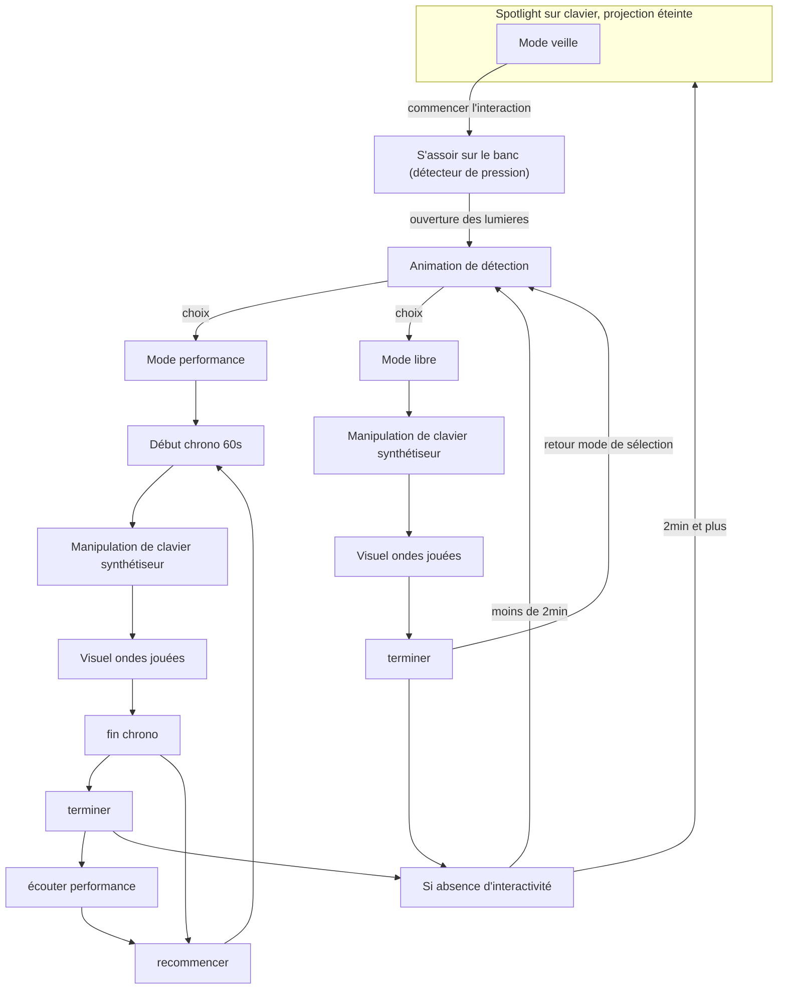

# Wave3D
*Faites prendre formes les sons que votre imagination compose*

## Concept

***Wave3D*** propose une interaction directe avec un synthétiseur qui, à chaque note jouée, fait vibrer des cordes physiques. Ces vibrations révèlent visuellement les ondes sonores et les fréquences produites. Le public est invité à expérimenter et à observer la manière dont les sons prennent forme, offrant une exploration à la fois auditive et visuelle des compositions musicales.

### Public cible & objectif narratif
- L'installation est conçue pour les gens de tout âge

L'installation invite le public à explorer la nature du son et des compositions mélodiques en découvrant les ondes que ceux-ci génèrent.

## Mise en scène

L'interacteur est accueilli dans une pièce sombre, où un projecteur éclaire un synthétiseur au centre, accompagné d'un banc sur lequel il est invité à s'asseoir. Une douce ambiance sonore joue en fond, renforçant l'immersion. Dès qu'il s'installe, un détecteur de pression sous le banc capte sa présence et déclenche une animation de bienvenue, illuminant les cordes face au clavier. L'interacteur est alors invité à jouer, produisant des ondes sonores qui font vibrer les cordes en synchronisation avec les notes. Il peut choisir entre deux modes : le mode "performance", pour enregistrer ses compositions, ou le mode "libre", pour explorer et s'amuser en toute simplicité avec le clavier.

## Moodboard Visuel

## Moodboard Sonore

## Scénario interactif

## Exemples concrets

## Outil et logiciel technique
