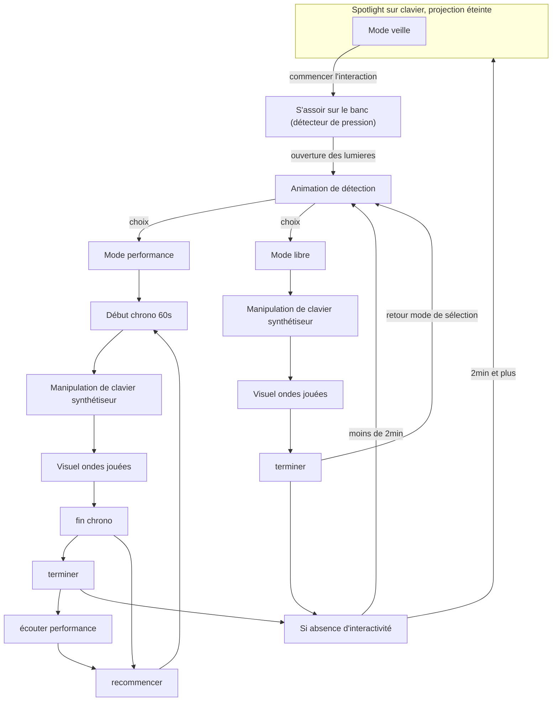

# Mélochroma
Faites jaillir les sons et mélodies de votre imagination pour les métamorphoser en une œuvre d'art vibrante, où chaque note peint un éclat de couleur sur la toile du réel.

## Public cible & objectif narratif
- L'installation est conçue pour les gens de tout âge

 

L'installation invite le public à explorer la fusion sensorielle entre la musique et la couleur, en transformant chaque mélodie jouée en une représentation visuel unique, créant ainsi une expérience immersive où son et image se rejoignent.

 

## Message Personnel

## Moodboard Visuel

## Moodboard Sonore

## Scénario interactif

## Exemples concrets

## Outil et logiciel technique
